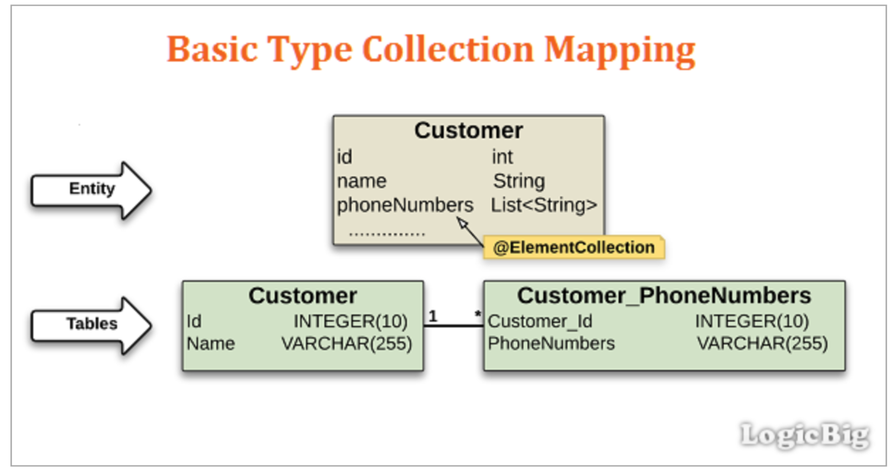
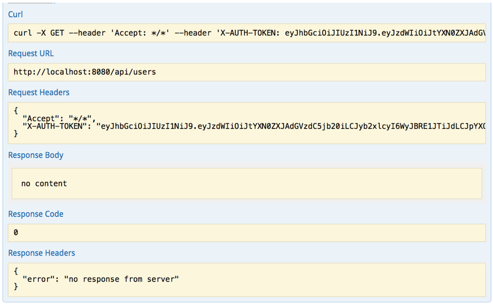

# 🔗 JWT와 SpringSecurity를 이용한 로그인 및 회원가입 REST API

이번 TimeLine API 프로젝트를 진행하면서 적용한 Jwt와 Spring Security 모듈 프로젝트이다. 처음 생각보다 내용이 복잡하고 어려웠다. 수 많은 삽질을 했고 이 삽질들을 기록하고자 따로 Repo를 만들었다. 

### JWT

+ JWT는 JWNO Web Token은 웹 표준으로 두 개체에서 가볍고 ***Self-contained*** 방식으로 정보를 안전성 있게 전달해준다. Java 뿐 아니라 C++, Phython 등 대부분의 주류 프로그래밍 언어에서 지원된다. 또한 두 개체 사이에서 쉽게 전달 될 수 있다. 웹 서버의 경우 HTTP 헤더에 넣어서 전달 할 수 있고, URL의 파라미터로 전달 할 수 도 있다. 이 프로젝트에서는 Request Header에 X-AUTH-TOKEN란 이름으로 전달한다.  
  `Self-contained : JWT는 필요한 모든 정보를 자체적으로 지니고 있다. JWT 시스템에서 발급된 토큰은 토큰에 대한 기본정보와 전달할 정보(ex. email), 그리고 토큰의 유효성을 증명해주는 signature을 포함하고 있다.`
+ JWT는 ***Header, Payload(내용) , Signature*** 로 구성된다.
  + Header는 **토큰의 타입을 지정하는 tpye**과 **해싱 알고리즘을 지정하는 alg**의 정보를 담고 있다
  + Payload는 토근에 담을 정보가 들어있다. 여기에 담는 정보의 한 조각을 **claim** 이라고 부르고 이는 key/value 형식으로 크게 registered claim, public claim, private cliam으로 나뉜다.
  + Sginature는 헤더의 인코딩 값과, 정보의 인코딩값을 합친 후 주어진 시크릿키로 해쉬를 생성한다.

### Spring Security

+ 스프링에서 제공하는 인증 및 권한 부여를 위한 프레임 워크 Spring Dispatcher Servlet 앞단에서 요청을 가로채 인증 및 권한 부여처리를 진행한다.
+ Spring Security는 기능별 필터의 집합으로 되어있다. 클라이언트가 리소스를 요청할 때 접근 권한이 없다면 **UsernamePasswordAuthenticationFilter가 로그인 폼으로 보내는데, Rest Api에서는 로그인 폼이 따로 없음으로 인증 권한이 없다는 오류 메시지를 출력해야한다**. 따라서 UsernamePasswordAuthenticationFilter 이전에 관련 처리를 하는 필터를 추가해야 한다.


## 삽질


### @ElementCollection

+ ElementCollection 태그는 1:N인 테이블 관계에서 별도의 설정없이 서로의 Pk만을 가지고 1의 테이블이 N을 리스트 형태로 가질 수 있게 해주는 어노테이션이다. 



+ 위 관계를 제대로 파악하지 못해 참고한 코드에서 Role 테이블을 어떻게 어디서 연관관계를 맺는지 한참 해맸다. 맵핑하는 테이블 이름은 아래와 같이 별도의 프로퍼티로 설정 해줄 수 있다. (컬럼이름도 지정 해줄 수 있는 듯 하다.)

  ```java
  @ElementCollection(fetch = FetchType.EAGER)
      @CollectionTable(name = "member_roles")
      private List<String> roles = new ArrayList<>();
  ```

  

### PasswordEncoder 

+ 발생 에러 

  **java.lang.IllegalArgumentException: There is no PasswordEncoder mapped for the id "null"**

+ 발생 원인

  **PasswordEncoder.matches 메소드에 두번째 인자는 반드시 encode 된 값**이어야 한다. 

+ Solution

  + 프론트에서 넘어온 인자를 인코드 처리를 하지 않고 넣어줘서 발생했다. 아래와 같이 해결한다.

  ```java
      @PostMapping(value = "/login")
      public String login(String email, String password){
          Member member = memberService.findByEmail(email).get();
          String encodePassword = passwordEncoder.encode(password);
          logger.info(member.toString());
  
          if(!passwordEncoder.matches(password, encodePassword))
              return "올바르지 않은 계정";
          return jwtTokenProvider.createToken(member.getEmail(), member.getRoles());
      }
  
  ```

  

### Response Code 0

+ 발생 문제

  + Spring Security에서 USER 권한을 가진 요청에 대해 계속 거절해 Response 가 아래와 같이 빈 내용이 출력되었다.

    

+ 발생 원인

  + Spring Security의 **hasRole 함수는 자동으로 주어진 인자에 'ROLE_' 접두어를 붙이고 검사를 시작**한다. 때문에 올바른 권한을 가질려면 USER가 아니라 ROLE_USER를 가져야 한다. 아래는 hasRole 함수 내부이다.

    ```java
    private static String hasRole(String role) {
            Assert.notNull(role, "role cannot be null");
            if (role.startsWith("ROLE_")) {
                throw new IllegalArgumentException("role should not start with 'ROLE_' since it is automatically inserted. Got '" + role + "'");
            } else {
                return "hasRole('ROLE_" + role + "')";
            }
        }
    ```

+ Solution

  1. hasRole 함수가 아닌 **hasAuthority** 함수를 사용한다.

  2. UserDetails 를 구현한 Entity 객체의 getAuthorities() 함수에서 ROLE_ 를 덧붙여준다.

     ```java
     @Override
         public Collection<? extends GrantedAuthority> getAuthorities() {
             return this.roles.stream()
                     .map(role -> new SimpleGrantedAuthority("ROLE_" + role))
                     .collect(Collectors.toList());
         }
     ```

     
     
 ## Reference
 https://velopert.com/2389
 https://daddyprogrammer.org/post/636/springboot2-springsecurity-authentication-authorization/
 https://www.logicbig.com/how-to/code-snippets/jcode-jpa-elementcollection.html
